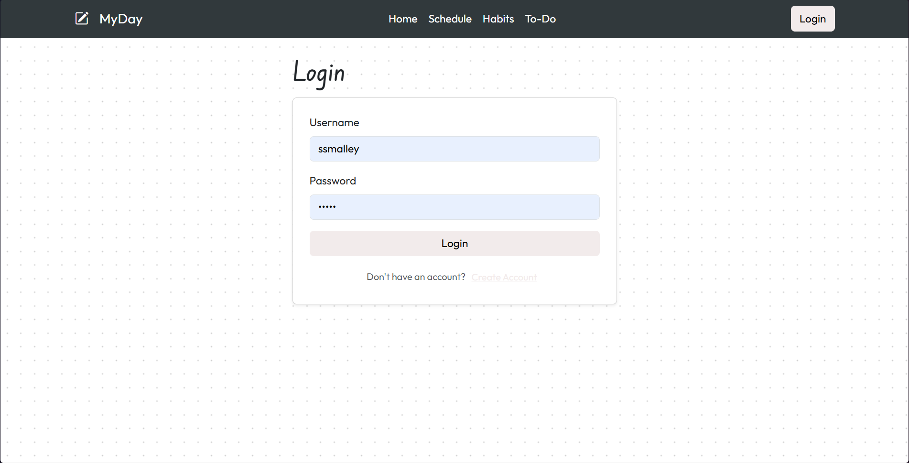

# MyDay
## Overview:
MyDay is an all-in-one daily planner application that lets users easily plan their schedules, make to-do lists, write down goals, and track habits.

## Current UI:
The homepage is a user's dashboard, displaying their calendar, goals, to-do items, and habit progress. 

There are pages for each of those features.

### Schedule:

### Habits:

### To-Do List:

### Login page:

## Goals for this project:
1. Create a functional backend for the application using Firebase.
2. Integrate Google Authentication.
3. Store users' data in Firestore.
4. Integrate Google Calendar and replace old schedule.
5. Make this an application that I would want to use every day.

## Database Design:

## System Design:

